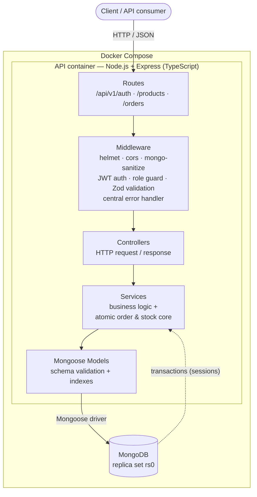

# Mini Order & Inventory API

A backend service for a small e-commerce operation that manages **products, users, and orders**, with a deliberate focus on **concurrency-safe stock management in MongoDB** — an order can **never oversell stock**, even under simultaneous requests.

Built with **Node.js + Express.js + MongoDB (Mongoose)** and fully containerized: one command brings up the API and its database.

> **Status:** 🚧 In active development. Progress is tracked in [Requirement Coverage](#requirement-coverage).

---

## Quick Start (for reviewers)

**Only requirement: Docker + Docker Compose.** No local Node.js, MongoDB install, or Atlas account needed.

```bash
git clone <repository-url>
cd mini-order-inventory-api
cp .env.example .env          # the only manual step — defaults work as-is
docker compose up --build     # builds the API and starts it together with MongoDB
```

Once it's running:

| What                       | Where                                                                                  |
| -------------------------- | -------------------------------------------------------------------------------------- |
| API base                   | `http://localhost:3000/api/v1`                                                         |
| Interactive docs (Swagger) | `http://localhost:3000/api/docs`                                                       |
| Health check               | `http://localhost:3000/health` → `{"success":true,"data":{"status":"ok","db":"connected"}}` |

**Inspect the stored data** (no extra tools needed — opens a Mongo shell inside the container):

```bash
docker exec -it moi_mongo mongosh
#   use mini_order_inventory
#   show collections
#   db.products.find().pretty()
```

Or connect **MongoDB Compass** to `mongodb://localhost:27017/?directConnection=true` (the `directConnection=true` is required because Mongo runs as a replica set).

**Run the automated test suite** (needs Node 20+; runs *without* Docker, using an in-memory MongoDB):

```bash
npm install && npm test
```

**Stop / reset:**

```bash
docker compose down       # stop the stack (stored data is preserved)
docker compose down -v    # stop and wipe all stored data
```

> **Trying the API** (signup → login → create product → place order) and the **pre-seeded admin test account** are documented under [API Documentation](#api-documentation) and [Test Accounts](#test-accounts) — populated as those endpoints are built in the next phases.

---

## Table of Contents

1. [Overview](#overview)
2. [Features](#features)
3. [Tech Stack](#tech-stack)
4. [Architecture](#architecture)
5. [Project Structure](#project-structure)
6. [Prerequisites](#prerequisites)
7. [Getting Started](#getting-started)
   - [Option A — Docker (recommended for reviewers)](#option-a--docker-recommended-for-reviewers)
   - [Option B — Local with MongoDB Atlas](#option-b--local-with-mongodb-atlas)
8. [Environment Variables](#environment-variables)
9. [API Documentation](#api-documentation)
10. [Concurrency & Data-Modeling Design](#concurrency--data-modeling-design)
11. [Testing](#testing)
12. [Security](#security)
13. [Requirement Coverage](#requirement-coverage)
14. [Stretch Goals](#stretch-goals)
15. [License](#license)

---

## Overview

Admins manage a product catalog with stock levels; customers place orders against that catalog. The system's defining requirement is correctness under concurrency: because MongoDB does not provide relational-style transactions by default, the approach to atomic stock updates is explicit and deliberate (see [Concurrency & Data-Modeling Design](#concurrency--data-modeling-design)).

## Features

- **JWT authentication** (signup / login) with hashed passwords
- **Role-based access control** (`admin` / `customer`) enforced via middleware
- **Product catalog CRUD** (admin-only writes) with **model-level validation**
- **Concurrency-safe order creation** — atomically validates and decrements stock
- **Pagination + filtering** on list endpoints
- **Consistent, structured error responses**; schema-based request validation (Zod)
- **Security hardening** — helmet, cors, NoSQL-injection sanitization, rate limiting
- **Automated tests**, including a **concurrency / race-condition** test
- **Dockerfile + docker-compose** (app + MongoDB) with **env-based config**
- **Structured logging** (pino) and a **`/health`** endpoint

## Tech Stack

| Concern        | Choice                                             | Why                                                                 |
| -------------- | -------------------------------------------------- | ------------------------------------------------------------------- |
| Language       | TypeScript 5                                       | Type safety end-to-end; compiled to JS for production               |
| Runtime        | Node.js 20 (LTS)                                   | Required stack; long-term support                                   |
| Framework      | Express.js 4                                        | Required stack; minimal, well-understood                            |
| Database       | MongoDB 7 (replica set)                            | Required stack; replica set enables multi-document transactions     |
| ODM            | Mongoose 8                                          | Model-level validation, schema hooks, first-class sessions          |
| Auth           | jsonwebtoken + bcryptjs                            | Standard JWT; `bcryptjs` is pure-JS → no native build in containers |
| Validation     | Zod                                                | Declarative request-body/query validation, clear errors            |
| Security       | helmet, cors, express-mongo-sanitize, express-rate-limit | Sensible defaults against common web/NoSQL-injection risks    |
| Logging        | pino / pino-http                                   | Fast structured JSON logging                                        |
| Testing        | Jest, Supertest, mongodb-memory-server (repl. set) | Isolated, fast; supports transactions in-memory                     |
| Container      | Docker (multi-stage), docker-compose               | One-command, reproducible startup                                   |

> **Stack note:** we use **Mongoose** over the native driver for its model-level validation (a requirement) and clean session/transaction API. We use **bcryptjs** rather than native `bcrypt` to keep the container build dependency-free and reliable.

## Architecture

Clean, layered separation of concerns — each layer has one job and is independently testable. Business logic (including the atomic stock/order core) lives in **services**, never in route handlers.



📐 **See [docs/ARCHITECTURE.md](docs/ARCHITECTURE.md)** for the full diagram set: request lifecycle, the order-creation concurrency sequence, and the data model (ER) diagram.

## Project Structure

```
mini-order-inventory-api/
├── src/
│   ├── config/          # env validation, DB connection
│   ├── models/          # Mongoose schemas (user, product, order)
│   ├── controllers/     # request/response handling
│   ├── services/        # business logic (order/stock core lives here)
│   ├── routes/          # endpoint definitions
│   ├── middleware/       # auth, role, validation, error handling
│   ├── validators/      # Zod schemas for request validation
│   ├── utils/           # ApiError, ApiResponse, asyncHandler, logger
│   ├── types/           # ambient type declarations
│   ├── app.ts           # Express app (middleware + routes wiring)
│   └── server.ts        # bootstrap: connect DB, start listening
├── tests/               # Jest + Supertest suites (incl. concurrency test)
├── dist/                # compiled JS output (generated by `npm run build`)
├── tsconfig.json        # TypeScript config (dev / typecheck / tests)
├── tsconfig.build.json  # TypeScript config (production build → dist)
├── .env.example
├── Dockerfile
├── docker-compose.yml
└── README.md
```

## Prerequisites

- **Docker** & **Docker Compose** — for Option A (nothing else needed).
- **Node.js 20+** and **npm** — for Option B and for running the test suite locally.
- A free **MongoDB Atlas** account — only for Option B.

## Getting Started

### Option A — Docker (recommended for reviewers)

```bash
cp .env.example .env        # defaults work out of the box
docker compose up --build
```

- API base: `http://localhost:3000/api/v1`
- Health: `http://localhost:3000/health`

Compose starts a MongoDB single-node **replica set** and the API together, with the API waiting until Mongo is healthy. No manual steps beyond copying `.env.example` to `.env`.

### Option B — Local with MongoDB Atlas

1. Create a free MongoDB Atlas cluster (see the step-by-step below / ask the maintainer).
2. `cp .env.example .env`, then set `MONGO_URI` to your Atlas connection string.
3. `npm install`
4. `npm run dev` — hot-reload dev server (TypeScript via `tsx`).

For a production-style local run: `npm run build && npm start` (compiles to `dist/`, then runs the compiled JS). Type-check without emitting: `npm run typecheck`.

> **MongoDB Atlas setup (summary):** create a free **M0** cluster → add a **database user** → allow your IP under **Network Access** → **Connect → Drivers** → copy the `mongodb+srv://…` string → paste into `.env` as `MONGO_URI` (append the DB name `mini_order_inventory`). Atlas clusters are replica sets, so transactions work out of the box.

## Environment Variables

All configuration is via environment variables (never hard-coded). See `.env.example`.

| Variable               | Required | Default                         | Description                                  |
| ---------------------- | -------- | ------------------------------- | -------------------------------------------- |
| `NODE_ENV`             | no       | `development`                   | `development` \| `test` \| `production`      |
| `PORT`                 | no       | `3000`                          | HTTP port                                    |
| `MONGO_URI`            | **yes**  | —                               | MongoDB connection string                    |
| `JWT_SECRET`           | **yes**  | —                               | Secret used to sign JWTs                     |
| `JWT_EXPIRES_IN`       | no       | `1d`                            | Token lifetime                               |
| `BCRYPT_SALT_ROUNDS`   | no       | `10`                            | bcrypt cost factor                           |
| `RATE_LIMIT_WINDOW_MS` | no       | `900000`                        | Rate-limit window (ms)                       |
| `RATE_LIMIT_MAX`       | no       | `100`                           | Max requests per window per IP               |

## API Documentation

Base URL: `/api/v1`. All responses use the envelope `{ "success": true, "data": … }` or `{ "success": false, "error": { "code", "message", "details"? } }`. More endpoints are documented here as they land.

**Interactive Swagger UI:** `http://localhost:3000/api/docs` (raw OpenAPI spec at `/api/docs.json`). Click **Authorize** and paste a token from `/auth/login` to try protected endpoints in the browser.

| Method | Endpoint                | Auth   | Description                                        |
| ------ | ----------------------- | ------ | -------------------------------------------------- |
| GET    | `/health`               | public | Liveness + DB connection status                    |
| GET    | `/api/v1`               | public | API metadata                                       |
| POST   | `/api/v1/auth/signup`   | public | Register a new customer; returns `{ user, token }` |
| POST   | `/api/v1/auth/login`    | public | Authenticate; returns `{ user, token }`            |
| GET    | `/api/v1/auth/me`       | Bearer | The current authenticated user                     |
| GET    | `/api/v1/products`      | public | List products — pagination + filter (`category`, `minPrice`/`maxPrice`, `sort`) |
| GET    | `/api/v1/products/:id`  | public | Get a single product                               |
| POST   | `/api/v1/products`      | admin  | Create a product                                   |
| PATCH  | `/api/v1/products/:id`  | admin  | Update a product                                   |
| DELETE | `/api/v1/products/:id`  | admin  | Delete a product                                   |
| _…orders endpoints documented as they are implemented…_ | | | |

### Example requests

```bash
# Register a customer (response includes a JWT)
curl -X POST http://localhost:3000/api/v1/auth/signup \
  -H "Content-Type: application/json" \
  -d '{"name":"Alice","email":"alice@example.com","password":"password123"}'

# Log in
curl -X POST http://localhost:3000/api/v1/auth/login \
  -H "Content-Type: application/json" \
  -d '{"email":"alice@example.com","password":"password123"}'

# Call a protected endpoint with the token from the response
curl http://localhost:3000/api/v1/auth/me \
  -H "Authorization: Bearer <TOKEN>"

# List products (public) — pagination + filtering
curl "http://localhost:3000/api/v1/products?page=1&limit=10&category=electronics"

# Create a product (requires an ADMIN token — see Test Accounts below)
curl -X POST http://localhost:3000/api/v1/products \
  -H "Authorization: Bearer <ADMIN_TOKEN>" \
  -H "Content-Type: application/json" \
  -d '{"name":"Wireless Mouse","price":25.99,"stock":100,"category":"electronics"}'
```

### Test Accounts

- **Sign up** (`POST /api/v1/auth/signup`) creates a **customer** by default — self-registering as an admin is intentionally *not* allowed (that would defeat role-based access control).
- To exercise **admin-only** endpoints, run the idempotent **seed script**, which creates an admin account plus a few sample products:
  ```bash
  docker compose exec app npm run seed     # when running via Docker
  npm run build && npm run seed            # locally (or: npm run seed:dev)
  ```
  Default admin credentials (override via `ADMIN_EMAIL` / `ADMIN_PASSWORD`): **`admin@example.com` / `admin12345`**. Log in with these via `POST /auth/login` to get an admin token.

## Concurrency & Data-Modeling Design

**The problem.** Multiple customers may order the same product at the same instant. A naïve "read stock → check → write" is a race: two requests both read `stock = 1`, both pass the check, both write, and the product oversells. MongoDB gives no relational-style transaction by default, so atomicity must be explicit.

**Our approach — a conditional atomic update, inside a transaction.** We combine two mechanisms:

1. **Conditional atomic update as the oversell guard.** For each product we run:

   ```js
   Product.findOneAndUpdate(
     { _id: productId, stock: { $gte: qty } }, // only match if enough stock
     { $inc: { stock: -qty } },                // decrement atomically
     { new: true, session }
   );
   ```

   The match and the decrement are a **single atomic document operation**. If two requests race, MongoDB serializes them at the document level; the one that would drive stock negative simply **doesn't match** the filter (returns `null`) and never decrements. This alone prevents overselling for a single product — lock-free.

2. **A multi-document transaction for all-or-nothing across an order.** An order can contain several products. We run all the conditional decrements inside a single Mongoose **transaction** (replica-set session). If any line item fails its `$gte` guard (insufficient stock) or the product doesn't exist, we **abort** — every decrement already applied in that order **rolls back** automatically. This gives the whole order true all-or-nothing semantics without hand-rolled compensation.

**Why both?** The conditional update is the correctness guarantee against overselling (sufficient on its own for a single-product order). The transaction is what makes a **multi-product** order atomic; without it we'd have to manually restore stock for earlier items when a later item fails — error-prone. Using the atomic guard *inside* the transaction combines per-document oversell safety with cross-document atomicity.

**Trade-off vs. the alternative (atomic update only, no transaction).** Atomic-update-only works on a standalone MongoDB (no replica set) and avoids transaction overhead, but needs explicit compensation logic for multi-item orders. We chose transactions because multi-item correctness is clearer and safer, and both MongoDB Atlas and our Docker setup run as replica sets. (Converting between the two is straightforward — a deliberate design point.)

**Edge cases handled.**

- **Duplicate line items** (same product listed twice in one order): quantities are **aggregated** before the stock check/decrement.
- **Insufficient stock:** `409 Conflict`, message identifies the product.
- **Non-existent product:** `404 Not Found`.
- **Invalid quantity** (≤ 0 or non-integer): `400 Bad Request` (rejected at validation).
- **Zero stock:** treated as insufficient for any quantity ≥ 1.

**Data modeling.**

- Order lines **snapshot the price** at purchase time (`priceAtPurchase`) so later price changes don't rewrite order history.
- **Indexes:** unique `user.email`; `product.category` (filtering); `order.user`, `order.status`, `order.createdAt` (own-order lookups, filtering, pagination).

## Testing

```bash
npm install
npm test
```

Tests use an **in-memory MongoDB replica set** (`mongodb-memory-server`), so no external database is needed (the MongoDB binary is downloaded once on first run). Coverage includes core CRUD paths, auth/role enforcement, order validation, and a **concurrency test** that fires many simultaneous orders against limited stock and asserts stock is never oversold.

## Security

- **JWT** auth; passwords hashed with bcrypt (via `bcryptjs`).
- **Role-based access control** enforced in middleware, not controllers.
- **helmet** (secure headers), configurable **cors**.
- **express-mongo-sanitize** + careful query construction to blunt NoSQL injection.
- **Rate limiting** on public endpoints.
- **No secrets in the repo** — all config via environment variables.

## Requirement Coverage

Tracks every requirement from the assessment PDF. Updated as work lands.

| # | Requirement (from PDF §3)                                             | Status         |
| - | -------------------------------------------------------------------- | -------------- |
| 3.1 | JWT auth (signup/login), hashed passwords (bcrypt)                 | ✅ Done        |
| 3.1 | Roles (admin/customer) + auth & role middleware                    | ✅ Done¹       |
| 3.1 | Admin: CRUD products / view all orders                             | ✅ Products / ⏳ orders (P3) |
| 3.1 | Customer: browse products / place & view own orders                | ✅ Browse / ⏳ orders (P3)   |
| 3.2 | Product CRUD (name, price, stock, category), admin-only writes     | ✅ Done        |
| 3.2 | Model-level schema validation                                      | ✅ Done        |
| 3.3 | Order creation: atomic stock validation + decrement (no oversell)  | ⏳ Phase 3     |
| 3.3 | Clear errors: insufficient stock / missing product / bad quantity  | ⏳ Phase 3     |
| 3.4 | Pagination + at least one filter on a list endpoint                | ✅ Done        |
| 3.5 | Consistent structured error format                                 | ✅ Done        |
| 3.5 | Schema-based input validation on write endpoints (Zod)             | 🟡 Auth + products² |
| 3.6 | Security middleware (helmet, cors)                                 | ✅ Foundation  |
| 3.6 | No secrets committed                                               | ✅ Done        |
| 3.6 | NoSQL-injection protection                                         | ✅ Foundation  |
| 3.7 | Automated tests incl. a concurrency/race scenario + CRUD           | ⏳ Planned     |
| 3.8 | Dockerfile                                                         | ✅ Done        |
| 3.8 | docker-compose (app + MongoDB, single command)                    | ✅ Done        |
| 3.8 | Env-based configuration                                            | ✅ Done        |
| 3.9 | README: setup, design decisions, API docs                          | ✅ In progress |

¹ `authenticate` and `authorize` middleware are implemented and test-covered; `authorize('admin')` is attached to admin-only routes as they are built (Phase 2–3).
² Signup/login and all product write endpoints are Zod-validated (plus query validation on the product list); order write endpoints get their schemas in Phase 3.

## Stretch Goals

| Goal (from PDF §4)                                          | Status      |
| ---------------------------------------------------------- | ----------- |
| CI pipeline (lint + tests on push)                         | ⏳ Optional  |
| Structured logging (pino) + `/health` endpoint             | ✅ Foundation |
| Rate limiting on a public endpoint                         | ✅ Foundation |
| Caching (Redis) for a read-heavy endpoint                  | ⏳ Optional  |
| Live cloud deployment                                      | ⏳ Optional  |
| Microservice / Kubernetes decomposition note              | ⏳ Optional  |

## License

MIT. The author retains full intellectual property rights to this project.
