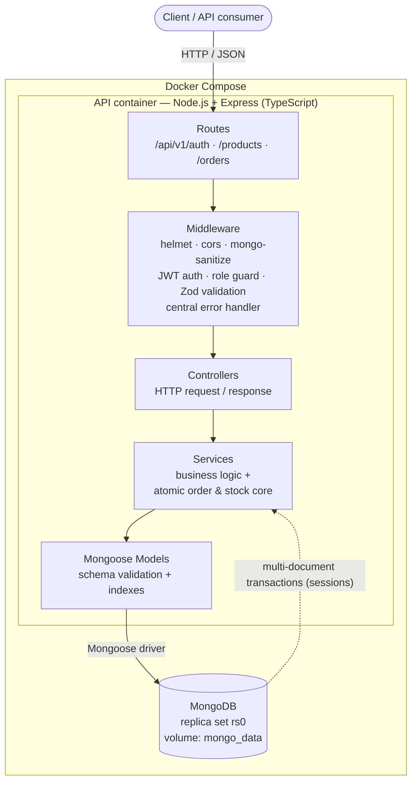
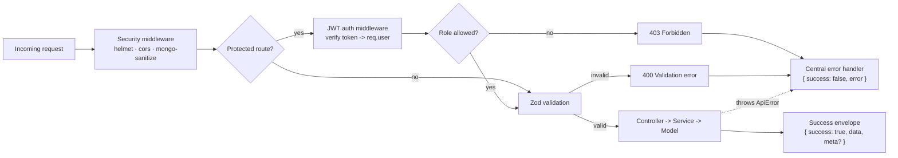
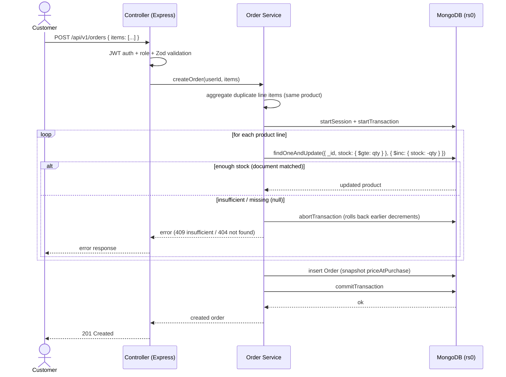
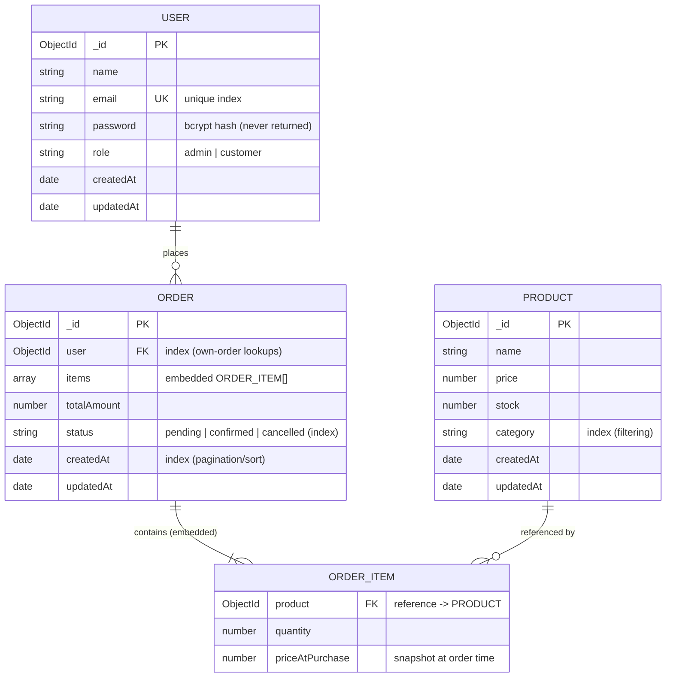

# Architecture

This document explains how the Mini Order & Inventory API is structured, how a request flows through it, how the concurrency-safe order flow works, and how the data is modeled. Diagrams are written in [Mermaid](https://mermaid.js.org/) so they render directly on GitHub and stay in version control.

> These diagrams reflect the **target design**. Components are implemented incrementally per the phase plan in the project README (see *Requirement Coverage*).

---

## 1. System & component overview

The whole system runs as two containers via Docker Compose: the Express API and a MongoDB replica set. Inside the API, responsibilities are split into clean layers (routes → middleware → controllers → services → models).

**Why layered?** Each layer has one job and is independently testable. The business logic — including the atomic stock/order core — lives in **services**, never in route handlers. This maps directly to the *Code quality & structure* evaluation criterion.

---

## 2. Request lifecycle

Every request passes through the same middleware pipeline before reaching business logic, and every error converges on one central handler that emits the API's consistent error envelope.

---

## 3. Order creation — the concurrency-safe core

This is the heart of the assessment. An order can contain several products; the system must never oversell stock even under simultaneous requests. We use a **conditional atomic update** (the oversell guard) executed **inside a multi-document transaction** (all-or-nothing across the order).

**Key points**

- The filter `{ stock: { $gte: qty } }` and the decrement `{ $inc: { stock: -qty } }` are **one atomic document operation** — the oversell guard. A losing racer simply doesn't match and returns `null`; it never drives stock negative.
- Wrapping all decrements in a **transaction** makes a multi-product order atomic: if any line fails, prior decrements roll back automatically (no hand-rolled compensation).
- **Order cancellation** reverses this: it restores stock with `{ $inc: { stock: +qty } }` inside a transaction and marks the order `cancelled`.

See the README's *Concurrency & Data-Modeling Design* section for the trade-off discussion (transaction vs. atomic-update-only).

---

## 4. Data model

Three collections. Order line items are **embedded** in the order document (a Mongoose subdocument array), not a separate collection — an order is a natural aggregate and is almost always read whole.

**Design choices**

- **Price snapshot** (`priceAtPurchase`): order history stays correct even when a product's price later changes.
- **Indexes**: unique `email`; `category` for product filtering; `user`, `status`, `createdAt` on orders for own-order lookups, filtering, and paginated sorting.
